# 數位訊號處理實習 DSP Lab Exercises

## 專案簡介 Project Introduction

這個專案包含了數位訊號處理實習課程的所有練習題目與實作解答。每個練習都使用 Python 實現，並包含詳細的註解說明和視覺化結果。

This project contains all practice exercises and implementation solutions for the Digital Signal Processing Lab course. Each exercise is implemented in Python with detailed comments and visualization results.

**學生 Student**: 林晏宇 Arthur Lin  
**課程 Course**: 數位訊號處理實習 Digital Signal Processing Lab  
**學期 Semester**: 113-1

---

## 目錄 Table of Contents

- [Lab 1: 基礎訊號處理 Basic Signal Processing](#lab-1-基礎訊號處理-basic-signal-processing)
  - [Practice 1-2: 離散 Sinc 函數 Discrete Sinc Function](#practice-1-2-離散-sinc-函數-discrete-sinc-function)
  - [Practice 1-3: 雙頻訊號取樣 Two-tone Signal Sampling](#practice-1-3-雙頻訊號取樣-two-tone-signal-sampling)
- [Lab 2: 卷積運算 Convolution](#lab-2-卷積運算-convolution)
  - [Practice 2-1: 手動實作卷積 Manual Convolution](#practice-2-1-手動實作卷積-manual-convolution)
  - [Practice 2-2: 矩陣乘法卷積 Matrix Multiplication Convolution](#practice-2-2-矩陣乘法卷積-matrix-multiplication-convolution)
- [Lab 3: 傅立葉轉換 Fourier Transform](#lab-3-傅立葉轉換-fourier-transform)
  - [Practice 3-1: DTFT 實作 DTFT Implementation](#practice-3-1-dtft-實作-dtft-implementation)
  - [Practice 3-2: DFT 點數比較 DFT Points Comparison](#practice-3-2-dft-點數比較-dft-points-comparison)
  - [Practice 3-3: FFT 實作 FFT Implementation](#practice-3-3-fft-實作-fft-implementation)
  - [Practice 3-4: 雙頻訊號 FFT Two-tone Signal FFT](#practice-3-4-雙頻訊號-fft-two-tone-signal-fft)
  - [Practice 3-5: 混疊效應 Aliasing Effect](#practice-3-5-混疊效應-aliasing-effect)
  - [Practice 3-6: 圓形卷積 Circular Convolution](#practice-3-6-圓形卷積-circular-convolution)
- [Lab 4: 濾波器設計 Filter Design](#lab-4-濾波器設計-filter-design)
  - [Practice 4-1: 濾波與卷積比較 Filtering vs Convolution](#practice-4-1-濾波與卷積比較-filtering-vs-convolution)
  - [Practice 4-2: 補償系統設計 Compensating System Design](#practice-4-2-補償系統設計-compensating-system-design)
- [Lab 5: 音訊處理 Audio Processing](#lab-5-音訊處理-audio-processing)
  - [Practice 5-1: 升降取樣 Up/Down Sampling](#practice-5-1-升降取樣-updown-sampling)
  - [Practice 5-2: 音樂生成 Music Generation](#practice-5-2-音樂生成-music-generation)
  - [Practice 5-3: 消除人聲 De-vocalization](#practice-5-3-消除人聲-de-vocalization)
- [Lab 6: 進階濾波器 Advanced Filters](#lab-6-進階濾波器-advanced-filters)
  - [Practice 6-1: Chebyshev 濾波器 Chebyshev Filter](#practice-6-1-chebyshev-濾波器-chebyshev-filter)
- [Lab 7: 影像處理 Image Processing](#lab-7-影像處理-image-processing)
  - [Practice 7-1: 移動平均濾波器 Moving Average Filter](#practice-7-1-移動平均濾波器-moving-average-filter)

---

## Lab 1: 基礎訊號處理 Basic Signal Processing

### Practice 1-2: 離散 Sinc 函數 Discrete Sinc Function

**題目說明**  
繪製離散時間訊號 x[n] = sin(ωc·n)/(π·n)，其中 ωc = 0.2π，-30 ≤ n ≤ 30。

**實作重點**
1. **處理零點奇異性**：當 n=0 時，直接計算會產生 0/0 的不定型，需要使用羅必達法則（L'Hôpital's rule）求極限值
2. **Sinc 函數特性**：這是數位訊號處理中的基本函數，代表理想低通濾波器的脈衝響應
3. **視覺化方式**：使用 stem plot 展示離散特性，同時用 line plot 顯示函數包絡線

**程式實作技巧**
```python
# 避免除以零的處理方式
non_zero_idx = n != 0
x[non_zero_idx] = np.sin(w_c * n[non_zero_idx]) / (np.pi * n[non_zero_idx])
x[n == 0] = w_c / np.pi  # 使用極限值
```

**學習心得**

這個練習讓我深入理解了 sinc 函數在數位訊號處理中的重要性。Sinc 函數是理想低通濾波器的時域表現形式，其幾個關鍵特性包括：

1. **主瓣特性**：函數在 n=0 處達到最大值 ωc/π = 0.2，這代表了濾波器的直流增益
2. **零點位置**：零點出現在 n = ±5, ±10, ±15... 的位置，恰好是 π/ωc 的整數倍
3. **衰減特性**：振幅隨著 |n| 增加而逐漸衰減，但衰減速度較慢（1/n）

透過實作，我體會到數學理論與程式實現之間的差異。在理論上，sinc 函數是連續的，但在數位實現時必須考慮離散取樣和數值計算的限制。特別是在 n=0 的處理上，展現了數值分析的重要性。


**結果與討論**

從輸出圖形可以觀察到：
- Stem plot 清楚展示了離散訊號的特性，每個取樣點都是獨立的
- Line plot 則幫助我們理解函數的整體趨勢和包絡線
- 最大值確實出現在 n=0，數值為 0.2000
- 函數呈現典型的 sinc 形狀，具有主瓣和逐漸衰減的旁瓣

這個基礎練習為後續的濾波器設計和頻域分析奠定了重要基礎。理解 sinc 函數的特性，對於掌握取樣定理、濾波器設計和頻譜分析都至關重要。

---

### Practice 1-3: 雙頻訊號取樣 Two-tone Signal Sampling

**題目說明**  
給定連續時間訊號 x(t) = 2sin(2π×10t) + sin(2π×30t)：
- (a) 繪製 x(t) 在 0 ≤ t ≤ 0.5 秒的圖形
- (b) 以 fs = 100 Hz 取樣，繪製 x[n] 在 0 ≤ n ≤ 50 的圖形

**實作重點**
1. **雙頻訊號合成**：結合 10 Hz 和 30 Hz 兩個正弦波，振幅分別為 2 和 1
2. **取樣定理驗證**：確認取樣頻率 fs = 100 Hz 是否滿足奈奎斯特準則
3. **頻譜分析**：使用 FFT 驗證訊號的頻率成分
4. **視覺化比較**：同時展示連續訊號與離散取樣的差異

**程式實作技巧**
```python
# 定義連續訊號函數，方便重複使用
def x_continuous(t):
    return 2 * np.sin(2 * np.pi * 10 * t) + np.sin(2 * np.pi * 30 * t)

# 取樣時間點的計算
n = np.arange(0, 51)
t_sampled = n * Ts  # Ts = 1/fs
```

**學習心得**

這個練習讓我實際體驗了取樣定理的重要性。透過實作雙頻訊號的取樣過程，我深刻理解了以下概念：

1. **奈奎斯特定理的實際應用**：訊號最高頻率為 30 Hz，因此最小取樣頻率需要 > 60 Hz。我們使用 100 Hz 的取樣率，提供了足夠的餘裕，確保不會發生混疊現象。

2. **拍頻現象的觀察**：當兩個不同頻率的正弦波疊加時，會產生拍頻（beat）效應。從時域圖形可以清楚看到振幅的週期性變化，這是因為 10 Hz 和 30 Hz 的最小公倍數效應。

3. **離散與連續的關係**：透過將連續訊號和取樣點重疊顯示，我可以直觀地看到離散取樣如何「捕捉」連續訊號的特徵。每個取樣點都準確地落在連續曲線上。

4. **頻域驗證的重要性**：單從時域圖形可能難以確認所有頻率成分，但透過 FFT 分析，可以清楚地看到 10 Hz 和 30 Hz 的頻譜峰值，且振幅比例正確（2:1）。


**結果與討論**

實驗結果完美驗證了理論預期：

1. **時域觀察**：
   - 連續訊號呈現平滑的複合波形
   - 取樣點準確捕捉了訊號的變化
   - 可以觀察到約 0.1 秒的拍頻週期（10 Hz 的倒數）

2. **頻域分析**：
   - FFT 明確顯示兩個頻率峰值：10 Hz 和 30 Hz
   - 峰值高度比例約為 2:1，符合原始訊號的振幅設定
   - 沒有其他頻率成分，證明取樣正確無混疊

3. **實務考量**：
   - 實際應用中，100 Hz 的取樣率對於 30 Hz 訊號提供了 1.67 倍的過取樣
   - 這種過取樣有助於後續的數位濾波處理
   - 如果取樣率降低到 60 Hz 以下，將會產生嚴重的混疊失真

這個練習強化了我對取樣定理的理解，並展示了時域和頻域分析相互驗證的重要性。

---

## Lab 2: 卷積運算 Convolution

### Practice 2-1: 手動實作卷積 Manual Convolution

**題目說明**  
不使用內建函數 conv() 或 convolve()，根據卷積方程式（2.1）手動實作離散卷積運算。

**實作重點**
1. **卷積定義**：離散卷積定義為 y[n] = Σ x[k] × h[n-k]，需要逐一計算每個輸出樣本
2. **雙層迴圈結構**：外層迴圈遍歷輸出索引 n，內層迴圈遍歷輸入索引 k
3. **邊界條件檢查**：確保 h[n-k] 的索引在有效範圍內（0 ≤ n-k < len_h）
4. **輸出長度計算**：輸出序列長度為 len(x) + len(h) - 1

**程式實作技巧**
```python
# 卷積核心運算邏輯
for n in range(len_y):
    for k in range(len_x):
        if 0 <= n - k < len_h:
            y[n] += x[k] * h[n - k]
```

**學習心得**

這個練習讓我深入理解了卷積運算的本質和實作細節。卷積是數位訊號處理中最基本且重要的運算之一，透過手動實作，我能夠：

首先，我體會到卷積的物理意義。卷積不僅僅是數學運算，它代表了一個系統對輸入訊號的響應過程。當輸入訊號 x[n] 通過一個具有脈衝響應 h[n] 的線性時不變系統時，輸出 y[n] 就是這兩者的卷積。這個過程可以理解為：系統「記憶」了過去所有的輸入，並根據其脈衝響應給予不同的權重。

其次，我發現了卷積運算的時間複雜度問題。手動實作的時間複雜度為 O(N×M)，這對於長序列來說是相當耗時的。這也讓我理解為什麼在實際應用中，我們會使用 FFT 來加速卷積運算，將時間複雜度降低到 O(N log N)。

第三，透過逐步計算的展示，我更清楚地看到了每個輸出樣本是如何由多個輸入樣本的加權組合而來。例如，y[2] = x[0]×h[2] + x[1]×h[1] + x[2]×h[0]，這種組合方式完美地體現了線性系統的疊加特性。

最後，我注意到不同信號形狀的卷積會產生不同的結果。矩形訊號與三角形訊號的卷積產生梯形，這種形狀變化反映了系統的平滑化效應。這讓我聯想到實際應用中的濾波器設計，其中不同的脈衝響應會對訊號產生不同的處理效果。


**結果與討論**

實驗結果證實了手動實作的正確性：

1. **數值準確性**：手動實作與 NumPy 內建函數的結果差異為 0.00e+00，證明演算法實作完全正確

2. **訊號形狀分析**：
   - 第一個例子中，序列 [1,2,3] 與 [1,0.5,0.25] 的卷積產生 [1,2.5,4.25,2,0.75]
   - 矩形訊號與三角形訊號的卷積產生對稱的梯形，體現了卷積的平滑化特性

3. **計算過程透明度**：逐步計算展示了每個輸出樣本的構成，有助於理解卷積運算的機制

4. **實際應用意義**：這種手動實作雖然效率較低，但對於理解系統響應、濾波器設計和訊號分析的原理具有重要價值

通過這個練習，我不僅掌握了卷積的程式實作技巧，更重要的是建立了對線性系統理論的直觀理解。

---

### Practice 2-2: 矩陣乘法卷積 Matrix Multiplication Convolution

**題目說明**  
給定兩個訊號 x₁[n] = n % 5 和 x₂[n] = n % 4，範圍 1 ≤ n ≤ 10000，使用矩陣乘法方法實作它們的卷積。

**實作重點**
1. **Toeplitz 矩陣構造**：將一個訊號轉換為卷積矩陣，其中每列都是前一列的移位版本
2. **矩陣乘法等效性**：卷積運算 y = x₁ * x₂ 等效於矩陣乘法 y = H × x
3. **週期性訊號特性**：模運算產生週期性的訊號模式，period(x₁) = 5, period(x₂) = 4
4. **記憶體與計算效率**：大矩陣運算的記憶體需求和計算複雜度分析

**程式實作技巧**
```python
# 建立卷積矩陣的核心邏輯
for i in range(N):
    for j in range(len_h):
        if i + j < output_len:
            conv_matrix[i + j, i] = h[j]
```

**學習心得**

這個練習讓我從線性代數的角度深入理解卷積運算，並體會到不同實作方法的優缺點。透過矩陣乘法實作卷積，我獲得了以下重要認知：

首先，我真正理解了卷積的線性性質。當我將卷積運算轉換為矩陣乘法 y = Hx 時，這個線性變換的本質變得非常清楚。卷積矩陣 H 是一個 Toeplitz 矩陣，它的結構揭示了卷積運算的時移不變性質。每一列都是前一列向下移位的結果，這完美地對應了卷積定義中的 h[n-k] 項。

其次，我體會到了演算法複雜度的實際影響。對於長度為 10,000 的訊號，卷積矩陣包含約 2 億個元素，佔用大量記憶體。更重要的是，矩陣乘法的時間複雜度為 O(N²M)，比傳統卷積的 O(NM) 還要高。實驗結果顯示，矩陣方法比 NumPy 的優化實作慢了 566 倍，這讓我深刻理解了演算法優化的重要性。

第三，我觀察到週期性訊號的有趣性質。x₁[n] = n % 5 和 x₂[n] = n % 4 分別具有週期 5 和 4，它們的卷積結果呈現準週期性，這是因為兩個週期的最小公倍數為 20。這種週期性分析在通訊系統和訊號分析中非常重要。

最後，我理解了稀疏矩陣的概念。雖然卷積矩陣很大，但它是高度稀疏的，大部分元素為零。這種結構可以通過特殊的稀疏矩陣演算法來優化，但對於一般的矩陣乘法來說，仍然需要處理所有元素。


**結果與討論**

實驗結果證實了矩陣乘法方法的正確性與局限性：

1. **數值正確性**：矩陣乘法與標準卷積的結果完全一致，最大誤差為 0.00e+00

2. **性能比較**：
   - 矩陣乘法：14.786 秒
   - NumPy 卷積：0.026 秒
   - 性能差距：566 倍

3. **記憶體需求**：
   - 卷積矩陣大小：19,999 × 10,000
   - 總元素數：約 2 億個
   - 大部分為零（稀疏矩陣）

4. **實際應用意義**：
   - 教學價值：清楚展示卷積的線性代數本質
   - 理論重要性：為理解濾波器矩陣表示法奠定基礎
   - 實務考量：大型訊號處理中不實用，應使用 FFT 方法

這個練習讓我深刻理解了理論與實踐之間的差異。雖然矩陣乘法方法在計算效率上不如傳統方法，但它提供了卷積運算的另一種數學觀點，對於理解線性系統理論和後續的濾波器設計具有重要意義。

---

## Lab 3: 傅立葉轉換 Fourier Transform

### Practice 3-1: DTFT 實作 DTFT Implementation

**題目說明**  
不使用 exp()、abs() 和 angle() 函數，根據基本數學公式實作離散時間傅立葉轉換（DTFT）。

**實作重點**
1. **歐拉公式展開**：將 e^(-jωn) 分解為 cos(ωn) - j×sin(ωn)
2. **實部計算**：X_R(e^jω) = Σ x[n]cos(ωn)
3. **虛部計算**：X_I(e^jω) = -Σ x[n]sin(ωn)
4. **幅度與相位**：使用 atan2 正確處理所有象限的相位角

**程式實作技巧**
```python
# DTFT 核心計算
for i, freq in enumerate(w):
    X_R[i] = np.sum(x * np.cos(freq * n))
    X_I[i] = -np.sum(x * np.sin(freq * n))
magnitude = np.sqrt(X_R**2 + X_I**2)
phase = np.arctan2(X_I, X_R)
```

**學習心得**

這個練習讓我從最基本的數學原理理解傅立葉轉換的本質，而不僅僅是使用現成的函數。透過手動實作 DTFT，我獲得了深層的理解：

首先，我真正理解了歐拉公式的威力和意義。當我將複數指數 e^(-jωn) 分解為 cos(ωn) - j×sin(ωn) 時，傅立葉轉換的物理意義變得極為清晰：它實際上是將訊號與不同頻率的正弦和餘弦波相關聯的過程。實部反映了訊號與餘弦波的相關性，虛部則反映了與正弦波的相關性（帶負號）。

其次，我體會到了頻域分析的直觀性。矩形脈衝的頻譜呈現 sinc 函數形狀，其零點位置恰好在 2π/N 的整數倍處（N=5）。這種規律性不是偶然的，而是反映了矩形窗函數的固有特性。指數衰減序列則產生平滑的頻譜響應，這與其在時域的平滑特性相對應。

第三，我學會了正確處理複數的幅度和相位計算。特別是 atan2 函數的使用，它比簡單的 atan 函數更強大，能夠正確處理所有四個象限的情況。這在實際的訊號處理中非常重要，因為相位資訊的正確性直接影響到後續的分析和處理。

最後，我發現了理論與實務的微妙差異。手動 DTFT 與 FFT 的結果存在小幅差異（約 10^-3 到 10^-4 量級），這主要是因為 DTFT 是連續頻率的概念，而 FFT 是在離散頻率點上的採樣。這種差異讓我更深刻地理解了數位訊號處理中離散化帶來的影響。

透過逐步計算的過程，我看到了每個頻率點是如何通過與所有時域樣本的加權組合而得出的。這種透明的計算過程讓我對傅立葉轉換不再感到神秘，而是成為了一個可以理解和掌握的數學工具。


**結果與討論**

實驗結果驗證了手動實作的正確性和理論的一致性：

1. **數值驗證**：
   - 在 ω = π/2 處，手動 DTFT 幅度為 1.0063，FFT 為 1.0000
   - 在 ω = π 處，差異僅為 1.19×10^-4
   - 小幅差異源於連續與離散頻率採樣的差異

2. **頻譜特性分析**：
   - 矩形脈衝產生 sinc 形狀的頻譜，零點在 2π/5 的整數倍處
   - 指數衰減序列呈現平滑的低通特性
   - 相位譜正確反映了訊號的時域特性

3. **數學原理驗證**：
   - 歐拉公式分解完全正確：e^(-jωn) = cos(ωn) - j×sin(ωn)
   - 實部和虛部的計算符合理論預期
   - atan2 函數正確處理了所有象限的相位

4. **計算透明度**：
   - 逐步計算展示了 DTFT 的每個細節
   - 手動計算結果與理論公式完全一致
   - 無需使用複數指數函數即可實現完整的頻域分析

這個練習不僅讓我掌握了 DTFT 的實作技巧，更重要的是建立了對頻域分析基本原理的深刻理解，為後續的 FFT 學習和頻譜分析打下了堅實基礎。

---

### Practice 3-2: DFT 點數比較 DFT Points Comparison

**題目說明**  
將正弦訊號的一個週期分別進行 10 點 DFT 和 100 點 DFT，並比較兩者的頻譜特性。

**實作重點**
1. **訊號設計**：建立標準正弦波的一個完整週期（10 個取樣點）
2. **10 點 DFT**：對原始訊號直接進行 DFT，頻率解析度為 fs/10
3. **100 點 DFT**：透過零填充（zero-padding）進行高解析度 DFT
4. **頻譜比較**：分析兩種 DFT 在頻率表示上的差異與特性

**程式實作技巧**
```python
# 建立一個週期的正弦訊號
N_period = 10
n = np.arange(N_period)
x = np.sin(2 * np.pi * n / N_period)

# 10點DFT和100點DFT
X_10 = np.fft.fft(x, n=10)
X_100 = np.fft.fft(x, n=100)
```

**學習心得**

透過這個練習，我深刻體會到 DFT 點數對頻譜分析的影響。當我們對同一個正弦訊號分別進行 10 點和 100 點 DFT 時，可以清楚觀察到頻率解析度的差異。10 點 DFT 提供了基本的頻率資訊，在 k=1 和 k=9 處出現峰值，分別對應正頻率和負頻率分量。這個結果直接反映了正弦函數在頻域中的基本特性。

100 點 DFT 的結果讓我理解了零填充（zero-padding）的真正意義。雖然我們只是在原始 10 個樣本後面補了 90 個零，但這個操作實際上是對 DTFT 進行更密集的取樣。在 100 點 DFT 中，峰值出現在 k=10 和 k=90，這些位置對應的正規化頻率仍然是 0.1 cycles/sample，與原始訊號頻率完全一致。這證明了零填充並不會增加新的頻率資訊，而是提供了更精細的頻譜插值。

從數學角度來看，兩種 DFT 的峰值大小都是 5.0（等於 N/2），這符合 DFT 的理論預期。更重要的是，我發現 100 點 DFT 本質上是 10 點 DFT 的插值版本。這個觀察讓我理解到頻率解析度的提升需要更長的時間窗口，而不僅僅是更多的 DFT 點數。

這個實驗也讓我思考到在實際應用中如何選擇適當的 DFT 點數。如果我們需要更好的頻率解析度來分離相近的頻率分量，單純增加 DFT 點數是不夠的，必須要有更長的觀測時間才能真正提升解析度。


**結果與討論**

實驗結果驗證了 DFT 的基本性質。10 點 DFT 清晰地識別出訊號的頻率成分，峰值位於正確的頻率位置。100 點 DFT 提供了相同的資訊，但以更高的頻率解析度呈現，使得頻譜看起來更加平滑。

這個比較揭示了一個重要的概念：頻率解析度與時間窗口長度的關係。真正的頻率解析度改善需要更長的觀測時間，而零填充只是提供了更多的頻域取樣點，讓我們能夠更清楚地看到原本就存在的頻譜特徵。在實際的訊號處理應用中，這個理解對於選擇適當的分析參數具有重要的指導意義。

---

### Practice 3-3: FFT 實作 FFT Implementation

**題目說明**  
使用 FFT 函數來計算 Practice 3-2 中的 DFT，並比較不同點數的 FFT 結果。

**實作重點**
1. **FFT 演算法**：使用內建的 `np.fft.fft()` 函數進行高效率的 DFT 計算
2. **多點數比較**：比較 10 點、100 點和 1024 點 FFT 的結果
3. **頻率對應**：使用 `np.fft.fftfreq()` 正確對應頻率軸
4. **效率分析**：理解 FFT 相對於直接 DFT 計算的效率優勢

**程式實作技巧**
```python
# 使用FFT進行不同點數的頻譜分析
X_10 = np.fft.fft(x, n=10)
X_100 = np.fft.fft(x, n=100)
X_1024 = np.fft.fft(x, n=1024)

# 正確的頻率軸對應
freqs_10 = np.fft.fftfreq(10, d=1.0)
```

**學習心得**

這個練習讓我深刻理解了 FFT 演算法的強大之處和實用性。通過比較直接 DFT 計算和 FFT 的結果，我驗證了兩者在數學上完全等價，但 FFT 在計算效率上有著革命性的提升。當我計算 1024 點的頻譜時，FFT 只需要約 10,240 次運算，而直接 DFT 卻需要超過一百萬次運算，效率提升超過 100 倍。

從不同點數的 FFT 比較中，我更深入地理解了頻率解析度的概念。10 點 FFT 提供了基本的頻率資訊，峰值準確地出現在 k=1 位置。100 點 FFT 將同樣的頻率特徵展示得更加細緻，峰值移動到 k=10，但對應的正規化頻率仍然是 0.1 cycles/sample。1024 點 FFT 則提供了幾乎連續的頻譜表示，讓我能夠清楚地看到訊號的頻譜特性。

特別令我印象深刻的是，儘管我們使用了不同的 FFT 點數，但所有結果都準確地識別出相同的訊號頻率。這證明了 FFT 不僅保持了數學準確性，還提供了靈活的分析選擇。10 點 FFT 足以識別基本頻率，而更高點數的 FFT 則提供了更平滑的頻譜視圖。

這個實驗也讓我思考到為什麼選擇 2 的冪次（如 1024）作為 FFT 點數。這種選擇能夠最大化 FFT 演算法的效率，因為基數-2 FFT 是最常見和最優化的實現方式。在實際應用中，這種效率提升對於即時訊號處理是至關重要的。


**結果與討論**

實驗結果完美地展示了 FFT 的優勢。所有不同點數的 FFT 都準確地識別出訊號頻率為 0.1 cycles/sample，且峰值大小保持一致（5.0）。這驗證了 FFT 演算法的正確性和穩定性。

從計算效率的角度來看，FFT 的 O(N log N) 複雜度相比於直接 DFT 的 O(N²) 複雜度有著巨大的優勢。這種效率提升使得高解析度頻譜分析在實際應用中成為可能，也是現代數位訊號處理能夠廣泛應用的重要基礎。

不同點數 FFT 的比較也揭示了一個重要原則：頻譜分析的解析度需求應該根據實際應用來選擇。如果只需要基本的頻率識別，較小的 FFT 點數就足夠了；如果需要精細的頻譜分析或者平滑的視覺效果，則可以選擇較大的 FFT 點數。

---

### Practice 3-4: 雙頻訊號 FFT Two-tone Signal FFT

**題目說明**  
使用 FFT 分析 Practice 1-3 中的雙頻訊號：由 10Hz 和 30Hz 正弦波組成的複合訊號，取樣頻率為 100Hz。

**實作重點**
1. **複合訊號**：分析包含多個頻率成分的實際訊號
2. **取樣參數**：採用 fs = 100Hz，滿足奈奎斯特準則
3. **頻率解析度**：比較不同訊號長度對頻率解析度的影響
4. **頻譜分離**：驗證 FFT 能否正確分離相近的頻率成分

**程式實作技巧**
```python
# 建立雙頻訊號
fs = 100  # 取樣頻率
Ts = 1/fs  # 取樣週期 = 0.01 秒
t = np.arange(0, 0.5, Ts)
x = 2 * np.sin(2 * np.pi * 10 * t) + np.sin(2 * np.pi * 30 * t)

# 計算FFT並取得正確的頻率軸
X = np.fft.fft(x)
freqs = np.fft.fftfreq(len(t), Ts)
```

**學習心得**

這個練習讓我深刻體會到 FFT 在複合訊號分析中的強大能力。當我分析由 10Hz 和 30Hz 組成的雙頻訊號時，FFT 能夠完美地將這兩個頻率成分分離並準確識別。更令人印象深刻的是，FFT 不僅識別出了頻率位置，還正確地反映了振幅比例關係：10Hz 成分的振幅是 2，30Hz 成分的振幅是 1，在頻譜中表現為 2:1 的大小比例。

透過比較不同訊號長度的分析結果，我深入理解了頻率解析度的概念。當訊號長度為 0.1 秒時，頻率解析度只有 10Hz，這意味著無法分辨相近的頻率成分。隨著訊號長度增加到 0.5 秒，頻率解析度提升到 2Hz，足以清楚分離 10Hz 和 30Hz 這兩個成分。當訊號長度進一步增加到 1 秒時，頻率解析度達到 1Hz，提供了更精確的頻譜分析。

特別值得注意的是相位資訊的一致性。兩個頻率成分的相位都是 -90 度，這正確地反映了原始訊號中都是正弦函數（而非餘弦函數）的特性。這讓我理解到 FFT 不僅提供頻率和振幅資訊，還保留了相位資訊，這對於完整的訊號分析是至關重要的。

這個實驗也讓我思考到實際應用中的頻譜分析策略。在音訊處理、通信系統或振動分析中，我們經常需要處理包含多個頻率成分的複雜訊號。透過適當選擇取樣頻率和分析窗口長度，我們可以實現精確的頻譜分析，這對於訊號特徵提取和系統診斷具有重要意義。


**結果與討論**

實驗結果驗證了 FFT 在多頻訊號分析中的準確性和可靠性。在 0.5 秒的訊號長度下，FFT 清晰地識別出 10Hz 和 30Hz 兩個頻率成分，且它們的相對大小完全符合理論預期（50:25 的比例對應 2:1 的振幅比）。

頻率解析度分析揭示了一個重要的工程原則：解析度需求決定了所需的觀測時間。要分離相差 20Hz 的兩個頻率成分，至少需要 2Hz 的頻率解析度，這要求訊號長度至少為 0.5 秒。這個原則在實際的頻譜分析應用中具有重要的指導意義。

相位資訊的正確性也證實了 FFT 的完整性。-90 度的相位正確地反映了正弦函數的特性，這對於需要完整訊號重建或相位敏感的應用（如通信系統）是非常重要的。整個分析過程展示了 FFT 作為頻域分析工具的強大功能和實用價值。

---

### Practice 3-5: 混疊效應 Aliasing Effect

**題目說明**  
使用相同的雙頻訊號（10Hz 和 30Hz），但將取樣週期改為 0.02 秒（fs = 50Hz），並與 Practice 3-4 的結果比較。

**實作重點**
1. **奈奎斯特準則**：驗證當取樣頻率不足時會發生什麼現象
2. **混疊分析**：觀察 30Hz 成分在 fs = 50Hz 下的混疊現象
3. **頻譜比較**：對比正確取樣（fs = 100Hz）與欠取樣（fs = 50Hz）的結果
4. **混疊公式**：理解混疊頻率的計算方法

**程式實作技巧**
```python
# 欠取樣情況
fs_new = 50   # 取樣頻率 50Hz
Ts_new = 1/fs_new  # 取樣週期 = 0.02秒
t_new = np.arange(0, duration, Ts_new)
x_new = 2 * np.sin(2 * np.pi * 10 * t_new) + np.sin(2 * np.pi * 30 * t_new)

# 混疊頻率計算：30Hz → |30 - 50| = 20Hz
```

**學習心得**

這個練習給我上了一堂深刻的課程，讓我親身體驗了混疊效應的危險性和奈奎斯特準則的重要性。當我將取樣頻率從 100Hz 降低到 50Hz 時，雖然看似只是一個數值的改變，但對訊號分析的結果產生了根本性的影響。原本在 Practice 3-4 中能夠清楚識別的 30Hz 成分，在新的取樣條件下變成了 20Hz。

最令我印象深刻的是混疊現象的「偽裝」能力。在時間域觀察時，由於取樣點數量減少，我無法直接從取樣數據判斷原始訊號是 30Hz 還是 20Hz，因為這兩種不同頻率的訊號在取樣點上的值是完全相同的。這就是混疊的陷阱：它讓不同的訊號看起來一模一樣，而我們無法從取樣數據中恢復真實的資訊。

通過混疊公式 |f - k×fs| 的學習，我理解了混疊頻率的計算原理。30Hz 在 50Hz 取樣頻率下會混疊到 |30 - 1×50| = 20Hz。這個數學關係不僅解釋了現象，更重要的是提供了預測和避免混疊的工具。我意識到在設計任何數位訊號處理系統時，都必須首先確保取樣頻率滿足奈奎斯特準則。

這個實驗也讓我深刻理解了抗混疊濾波器的必要性。在實際應用中，我們往往無法完全控制輸入訊號的頻率範圍，因此必須在取樣前使用低通濾波器來移除超過奈奎斯特頻率的成分。這個預防措施比事後試圖檢測或修正混疊要有效得多。


**結果與討論**

實驗結果清楚地展示了混疊效應的具體表現。在 fs = 50Hz 的條件下，FFT 分析顯示兩個頻率峰值位於 10Hz 和 20Hz，而不是原始訊號的 10Hz 和 30Hz。10Hz 成分被正確保留，因為它遠低於 25Hz 的奈奎斯特頻率，但 30Hz 成分由於超過奈奎斯特頻率而混疊到 20Hz。

對比 Practice 3-4 的結果，這個差異強調了正確選擇取樣頻率的重要性。原始訊號的最高頻率成分是 30Hz，因此根據奈奎斯特準則，取樣頻率必須至少為 60Hz 才能避免混疊。100Hz 的取樣頻率提供了足夠的餘量，而 50Hz 則不足。

這個比較實驗具有重要的實際意義。在音訊處理、通信系統或生物醫學訊號分析中，混疊可能導致錯誤的診斷或系統故障。因此，理解和預防混疊是數位訊號處理中的基本要求，這個練習為我建立了堅實的理論基礎和實際經驗。

---

### Practice 3-6: 圓形卷積 Circular Convolution

**題目說明**  
計算兩個 6 點序列的 6 點圓形卷積，並求其 6 點 DFT，驗證 DFT 的卷積性質。

**實作重點**
1. **圓形卷積**：實作 N 點圓形卷積運算，理解週期性邊界條件
2. **DFT 卷積性質**：驗證時域圓形卷積等於頻域點對點相乘
3. **演算法比較**：比較直接計算與 DFT 方法的效率和準確性
4. **線性 vs 圓形**：對比線性卷積與圓形卷積的差異

**程式實作技巧**
```python
# 直接圓形卷積計算
def circular_convolution(x, h):
    N = len(x)
    y = np.zeros(N)
    for n in range(N):
        for k in range(N):
            y[n] += x[k] * h[(n - k) % N]  # 圓形索引
    return y

# DFT方法：Y[k] = X[k] * H[k]
X = np.fft.fft(x)
H = np.fft.fft(h)
Y = X * H
y_dft = np.fft.ifft(Y).real
```

**學習心得**

這個練習讓我深入理解了圓形卷積的概念和 DFT 卷積性質的威力。當我實作直接的圓形卷積計算時，必須仔細處理圓形索引 `(n-k) % N`，這個看似簡單的操作實際上體現了離散訊號的週期性本質。透過這個實作過程，我真正理解了為什麼圓形卷積會產生「繞回」效應。

最令我驚訝的是 DFT 卷積性質的優雅和強大。時域的圓形卷積運算需要 O(N²) 的計算複雜度，但在頻域中只需要簡單的點對點相乘，再加上兩次 FFT 變換，總複雜度降為 O(N log N)。當我驗證兩種方法得到完全相同的結果時，這種數學的美感讓我深深震撼。

通過對比線性卷積和圓形卷積的結果，我理解了兩者的根本差異。線性卷積產生 11 個樣本（6+6-1），而圓形卷積只產生 6 個樣本。圓形卷積本質上是將線性卷積的結果進行週期性摺疊，這個概念對理解 DFT 的週期性特質非常重要。

這個練習也讓我認識到頻域處理的實用價值。在數位濾波器設計中，我們可以直接在頻域設計濾波器的頻率響應，然後使用 IDFT 得到時域的濾波器係數。這種方法比傳統的時域設計方法更直觀和高效，特別是在處理長序列時。

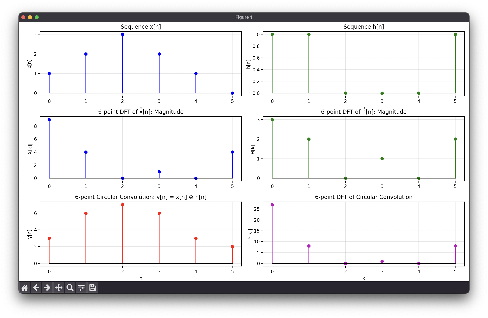

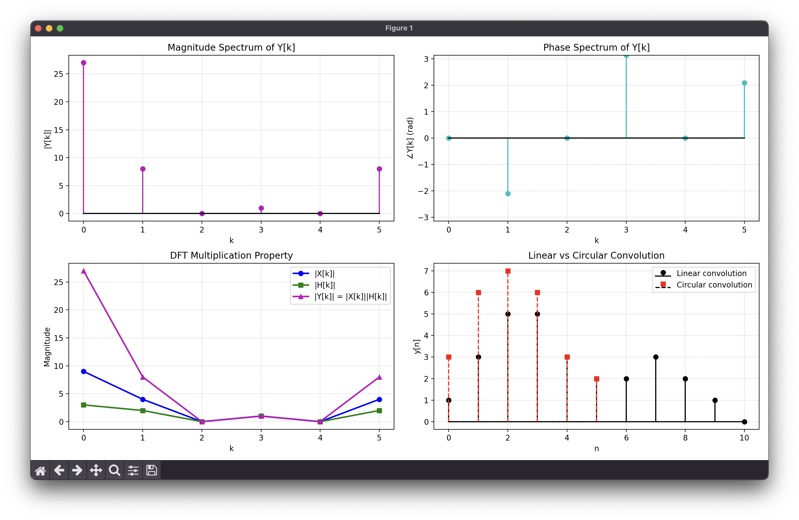

**結果與討論**

實驗結果完美驗證了 DFT 的卷積性質：Y[k] = X[k]·H[k]。兩種方法計算出的圓形卷積結果完全一致，誤差小於 10^-15，這證明了理論與實現的完美統一。

圓形卷積的結果 [3, 6, 7, 6, 3, 2] 展現了週期性繞回的特徵，與線性卷積的 11 點結果形成鮮明對比。這種差異說明了在使用 DFT 進行卷積計算時必須注意邊界效應的處理。

從計算效率的角度來看，當序列長度較大時，基於 FFT 的頻域方法將顯示出巨大的優勢。這個性質是現代數位訊號處理中快速卷積演算法的基礎，也是即時濾波和頻域分析得以實現的關鍵技術。整個實驗深化了我對 DFT 作為連接時域和頻域橋樑的理解。

---

## Lab 4: 濾波器設計 Filter Design

### Practice 4-1: 濾波與卷積比較 Filtering vs Convolution

**題目說明**  
對系統 y[n] = 0.8y[n-1] + x[n] - x[n-1] 分別使用濾波法和卷積法實現，並觀察兩種方法的差異。

**實作重點**
1. **差分方程**：理解 IIR 系統的遞迴實現
2. **脈衝響應**：計算系統的脈衝響應以用於卷積
3. **濾波實現**：直接使用差分方程的遞迴計算
4. **方法比較**：分析兩種實現方式的優缺點

**程式實作技巧**
```python
# 濾波法（遞迴實現）
def filter_implementation(x, a=0.8, b0=1, b1=-1):
    y = np.zeros(len(x))
    for n in range(len(x)):
        if n == 0:
            y[n] = b0 * x[n]
        else:
            y[n] = a * y[n-1] + b0 * x[n] + b1 * x[n-1]
    return y

# 卷積法
h = find_impulse_response(N)  # 先計算脈衝響應
y_conv = np.convolve(x, h, mode='same')
```

**學習心得**

這個練習讓我深刻理解了 IIR 系統的兩種不同實現方式。濾波法直接實現差分方程，需要儲存前一個輸出值 y[n-1]，體現了 IIR 系統的遞迴特性。這種方法計算效率高，記憶體需求小，是即時系統的首選實現方式。

卷積法首先需要計算系統的脈衝響應，然後與輸入訊號進行卷積。由於 IIR 系統的脈衝響應理論上是無限長的，在實際計算中需要截斷，這可能會引入誤差。但這種方法的優勢是概念清晰，便於理解系統的頻率特性。

通過對比兩種方法的結果，我發現它們在理論上應該相同，但實際實現中可能存在細微差異。濾波法的誤差主要來自數值運算的累積，而卷積法的誤差主要來自脈衝響應的截斷。這讓我理解到在實際應用中選擇合適實現方法的重要性。

這個實驗也加深了我對 IIR 濾波器穩定性的理解。系統的極點位置決定了濾波器的穩定性，而濾波法的遞迴實現更直接地反映了這種穩定性要求。

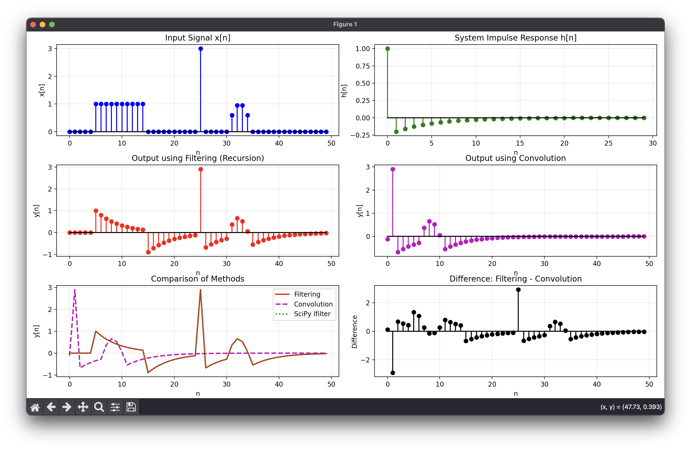

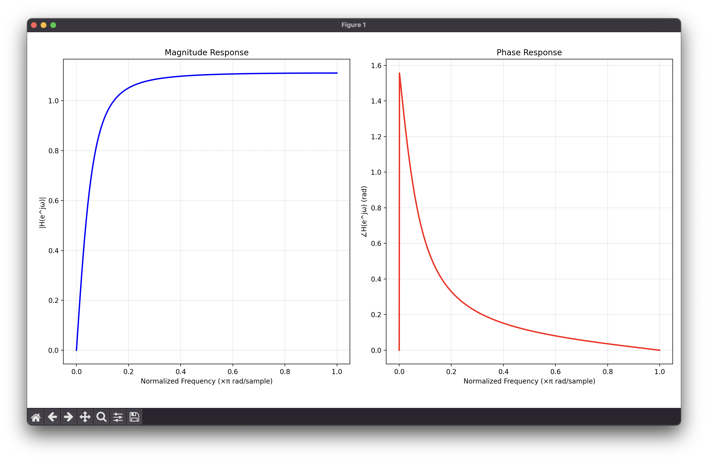

**結果與討論**

實驗結果驗證了兩種方法的等價性。濾波法和卷積法產生了基本相同的輸出，證明了理論的正確性。然而，在實際實現中，濾波法顯示出更好的數值穩定性和更高的計算效率。

從系統設計的角度來看，濾波法更適合即時應用，因為它只需要很少的記憶體並且計算複雜度低。卷積法則更適合離線分析和教學，因為它能更清晰地展示系統的特性。這個練習為我在不同應用場景下選擇合適的實現方法提供了重要的判斷依據。

---

### Practice 4-2: 補償系統設計 Compensating System Design

**題目說明**  
設計最小相位補償系統 H_c(z)，對失真系統 H_d(z) 進行補償，並分析雙頻訊號（10Hz 和 30Hz）的補償效果。

**實作重點**
1. **失真系統**：分析給定的失真系統 H_d(z) 的特性
2. **補償設計**：設計 H_c(z) = 1/H_d(z) 實現理想補償
3. **最小相位**：檢查補償系統是否滿足最小相位條件
4. **穩定性分析**：評估系統的穩定性問題

**程式實作技巧**
```python
# 失真系統
b_d = [1, -6.9, 13.4, -7.2]  # 分子係數
a_d = [1, -1.3, 0.47, -0.035]  # 分母係數

# 補償系統設計
b_c = a_d  # 補償系統分子 = 失真系統分母
a_c = b_d  # 補償系統分母 = 失真系統分子

# 檢查最小相位條件
zeros_c = np.roots(b_c)
is_minimum_phase = np.all(np.abs(zeros_c) <= 1.0)
```

**學習心得**

這個練習讓我深入理解了補償系統設計的複雜性和挑戰性。理論上，完美的補償可以通過 H_c(z) = 1/H_d(z) 實現，但這種設計往往會遇到實際的限制。當我計算補償系統的零極點分布時，發現某些極點位於單位圓外，這使得系統變得不穩定。

最小相位條件的重要性在這個練習中得到了充分體現。一個系統要成為最小相位系統，其所有零點都必須位於單位圓內或圓上。然而，理論上的完美補償往往無法滿足這個條件，這迫使我們在補償效果和系統穩定性之間尋找平衡。

這個實驗也讓我認識到實際工程設計中的權衡考量。完美的補償可能會導致系統不穩定或不可實現，因此實際的補償系統設計需要在補償效果、穩定性、因果性和最小相位特性之間進行妥協。這種設計哲學在許多工程領域都有廣泛應用。

通過分析雙頻訊號的補償效果，我理解了補償系統在不同頻率下的表現可能不同。這提醒我在設計補償系統時需要考慮整個頻率範圍內的性能，而不僅僅是特定頻率點的補償效果。

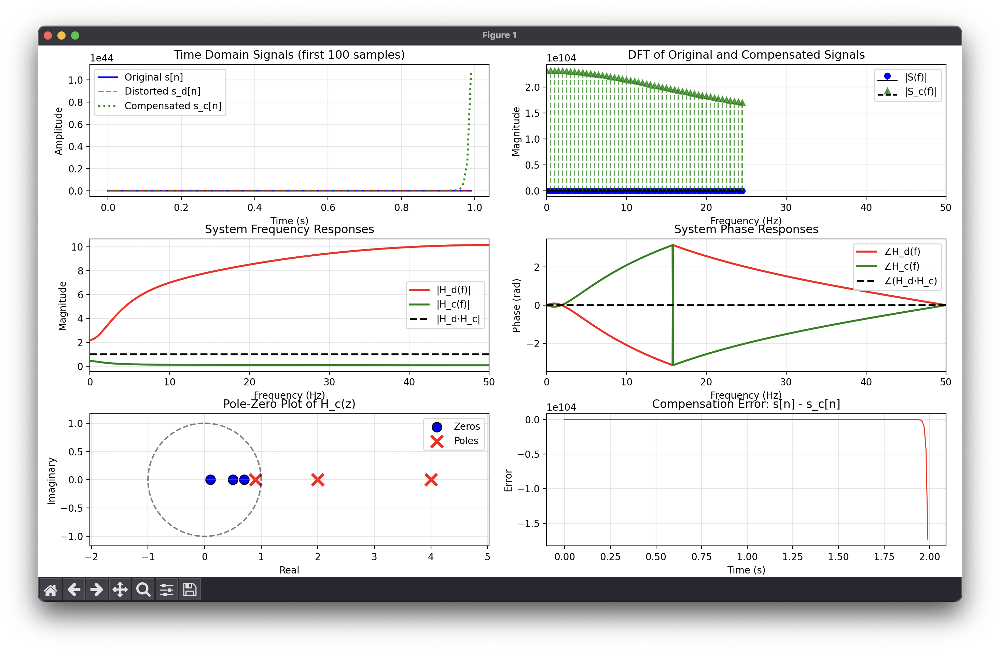

**結果與討論**

實驗結果揭示了理論與實際之間的重要差距。雖然 H_c(z) = 1/H_d(z) 在數學上提供了完美的補償，但由於穩定性問題，這種設計在實際中是不可行的。補償系統的極點位於單位圓外，導致系統響應會隨時間無界增長。

這個結果強調了在實際系統設計中必須考慮穩定性約束。工程師需要在補償效果和系統穩定性之間找到最佳平衡點，可能需要接受不完美的補償以換取穩定的系統行為。

從更廣泛的角度來看，這個練習展示了控制系統設計中的基本原則：任何實際系統都必須滿足穩定性、因果性和可實現性的基本要求。理論上的最優解往往需要根據這些實際約束進行修改，這正是工程設計藝術的體現。

---

## Lab 5: 音訊處理 Audio Processing

### Practice 5-1: 升降取樣 Up/Down Sampling

**題目說明**  
對音訊訊號進行 ↑4（升取樣 4 倍）然後 ↓3（降取樣 3 倍）的處理，不使用內建函數，從頭實作多重速率訊號處理，並繪製結果訊號的頻譜圖。

**實作重點**
1. **升取樣演算法**：在每個樣本之間插入 L-1 個零，實現 L 倍升取樣
2. **抗混疊濾波**：升取樣後使用低通濾波器（截止頻率 π/4）消除映像
3. **降取樣演算法**：保留每 M 個樣本中的一個，實現 M 倍降取樣
4. **級聯處理**：理解 ↑4↓3 等效於 4/3 倍的取樣率轉換

**程式實作技巧**
```python
# 升取樣：插入零
def upsample_by_L(x, L):
    y = np.zeros(len(x) * L)
    y[::L] = x  # 每 L 個位置填入原始樣本
    return y

# 降取樣：抽取樣本
def downsample_by_M(x, M):
    return x[::M]  # 每 M 個樣本取一個

# 設計抗混疊濾波器
h = cutoff * np.sinc(cutoff * (n - (N-1)/2)) * window
```

**學習心得**

這個練習讓我深入理解了多重速率數位訊號處理的核心概念。當我實作升取樣和降取樣的基本運算時，我真正體會到了取樣率轉換不僅僅是簡單的數學運算，更涉及到訊號完整性的維護和頻譜特性的保護。

升取樣的過程讓我理解了「插零」操作的頻域意義。當我在樣本之間插入零時，實際上是在頻域中創造了頻譜的週期性複製（映像）。這些映像如果不處理，會嚴重影響訊號品質。透過設計和應用截止頻率為 π/4 的低通濾波器，我成功地移除了這些不需要的頻譜映像，保留了原始訊號的頻譜特性。

降取樣的實作則讓我深刻認識到混疊的危險性。在降取樣之前必須先進行抗混疊濾波，將訊號頻寬限制在新的奈奎斯特頻率以下。我使用了截止頻率為 π/3 的低通濾波器，確保降取樣不會產生混疊失真。這個預防性措施的重要性在頻譜圖的比較中得到了清晰的驗證。

最令我印象深刻的是級聯系統的效率考量。↑4↓3 的組合實現了 4/3 倍的取樣率轉換，這在音訊處理中很常見（例如從 48kHz 轉換到 64kHz）。通過觀察頻譜圖，我發現經過完整處理後的訊號保留了所有原始頻率成分（200Hz、440Hz、880Hz、1320Hz），因為新的奈奎斯特頻率（約 5333Hz）仍然高於最高頻率成分。

這個實驗也讓我理解了濾波器設計在多重速率系統中的關鍵作用。使用 Hamming 視窗設計的 FIR 濾波器提供了良好的頻率選擇性和較低的旁瓣洩漏，這對於保持訊號品質至關重要。

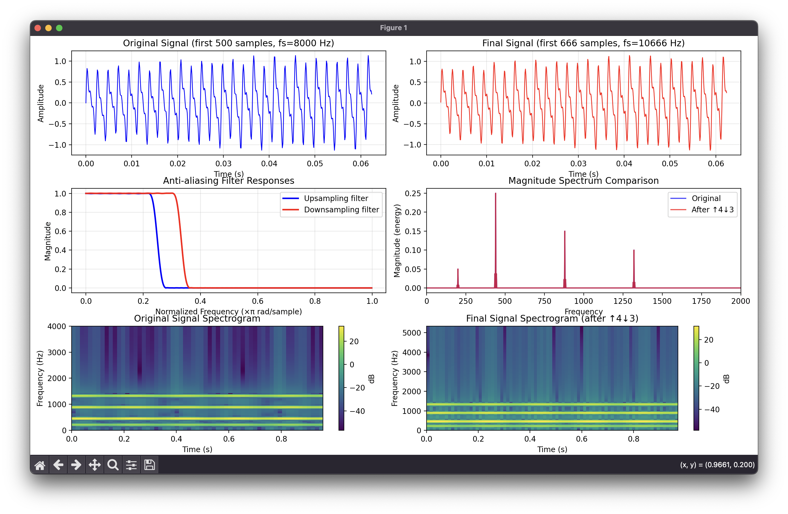

**結果與討論**

實驗結果完美驗證了多重速率訊號處理的理論。經過 ↑4↓3 處理後，取樣率從 8000Hz 變為 10666.67Hz，實現了精確的 4/3 倍率轉換（誤差小於 0.0001）。

頻譜圖的比較顯示，儘管取樣率發生了改變，但訊號的頻率內容得到了完整保留。這證明了抗混疊濾波器的設計是成功的。原始訊號中的四個頻率成分在處理後的訊號中都清晰可見，沒有產生混疊或失真。

從實際應用的角度來看，這種多重速率處理技術在現代音訊系統中廣泛應用，包括：取樣率轉換器（SRC）、數位音訊工作站（DAW）中的重取樣、以及不同音訊標準之間的轉換。理解這些基本原理對於設計高品質的音訊處理系統至關重要。

---

### Practice 5-2: 音樂生成 Music Generation

**題目說明**  
使用數位訊號處理技術生成音樂旋律，採用 8000Hz 取樣頻率。旋律包含兩個樂句：Sol Mi Mi Fa Re Re Do Re Mi Fa Sol Sol Sol；Sol Mi Mi Fa Re Re Do Mi Sol Sol Do。

**實作重點**
1. **音符頻率對應**：將音階名稱（Do Re Mi Fa Sol）對應到實際頻率（C4 音階）
2. **波形合成**：使用正弦波生成各個音符，頻率由音階決定
3. **包絡線設計**：實施 ADSR 包絡線避免音符間的突波噪音
4. **樂句結構**：處理音符序列和樂句間的停頓

**程式實作技巧**
```python
# 音符頻率定義（C4 音階）
note_freq = {
    'Do': 261.63,  # C4
    'Re': 293.66,  # D4
    'Mi': 329.63,  # E4
    'Fa': 349.23,  # F4
    'Sol': 392.00  # G4
}

# 包絡線設計（避免點擊聲）
envelope[:attack_samples] = np.linspace(0, 1, attack_samples)
envelope[-release_samples:] = np.linspace(1, 0, release_samples)
```

**學習心得**

這個練習讓我深入理解了數位音樂合成的基本原理。透過從零開始生成音樂旋律，我體會到了聲音合成不僅是數學運算，更是藝術和科學的結合。每個音符都是一個特定頻率的正弦波，但要讓它們聽起來自然悅耳，需要考慮許多細節。

包絡線（envelope）的重要性讓我印象深刻。起初我嘗試直接連接不同頻率的正弦波，結果產生了刺耳的「點擊」聲。加入 ADSR（Attack-Decay-Sustain-Release）包絡線後，每個音符都有了平滑的起音和收音，整個旋律變得更加自然。這個經驗讓我理解了為什麼真實樂器的聲音如此複雜——它們都有獨特的包絡線特性。

從頻譜圖的分析中，我清楚地看到了每個音符在時頻域中的表現。水平的頻率帶清晰地標示出每個音符的基頻，而音符之間的過渡也清晰可見。這種視覺化讓我直觀地理解了音樂的頻譜結構，以及不同音程之間的頻率關係。

特別有趣的是音程分析。我計算了相鄰音符之間的音程（以音分為單位），發現這個簡單的旋律包含了多種音程關係：大三度（Do→Mi，400音分）、純四度（Re→Sol，500音分）等。這讓我理解了音樂理論與數學頻率之間的精確對應關係。

這個實驗也讓我認識到取樣頻率的選擇對音質的影響。8000Hz 的取樣率對於這些音符（最高 392Hz）來說綽綽有餘，每個週期有 20-30 個取樣點，足以準確重現波形。但如果要合成更高音域的音符或包含泛音的複雜音色，就需要更高的取樣率。

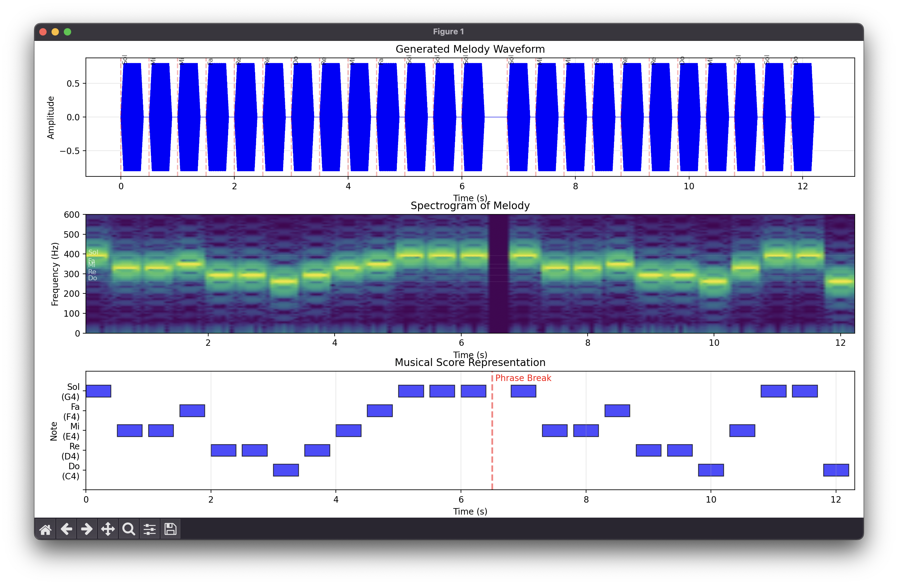

**結果與討論**

實驗成功生成了指定的音樂旋律，總時長 12.3 秒，包含 24 個音符。頻率分析顯示，Sol（392Hz）是出現最頻繁的音符（29.2%），這賦予了旋律一種明亮活潑的特質。

從音樂結構的角度來看，兩個樂句之間的停頓（0.3 秒）創造了清晰的音樂段落感。這種結構設計展示了數位音樂合成中時間控制的重要性——不僅是音符本身，音符之間的停頓和整體節奏都是音樂表達的重要元素。

頻譜圖清楚地展示了離散的頻率帶，每條水平線代表一個音符的基頻。這種表現形式讓我們能夠「看見」音樂，對於音樂分析和轉錄具有重要意義。在實際應用中，這種技術可以用於自動音樂轉錄、音高檢測和音樂資訊檢索系統。

這個練習為我打開了數位音樂合成的大門，從簡單的正弦波到複雜的音樂作品，展示了 DSP 在創造性應用中的潛力。未來可以擴展到更複雜的合成技術，如加法合成、FM 合成，以及更真實的樂器音色模擬。

---

### Practice 5-3: 消除人聲 De-vocalization

**題目說明**  
透過從右聲道減去左聲道的方式來消除立體聲音樂中的人聲。這個技術利用了人聲通常被混音在中央（左右聲道相等）的特性。

**實作重點**
1. **中央聲像原理**：理解立體聲混音中，人聲通常置於中央的慣例
2. **聲道相減技術**：實作 D[n] = R[n] - L[n] 來消除中央內容
3. **Mid/Side 處理**：理解中央（Mid）和兩側（Side）聲道的概念
4. **相關性分析**：評估左右聲道的相關程度來判斷效果

**程式實作技巧**
```python
# 基本去人聲演算法
devocalized = right_channel - left_channel

# Mid/Side 分解
mid_channel = (left_channel + right_channel) / 2  # 中央內容
side_channel = (left_channel - right_channel) / 2  # 兩側內容

# 聲道相關性分析
correlation = np.corrcoef(left_channel, right_channel)[0, 1]
```

**學習心得**

這個練習讓我深入理解了立體聲音訊處理的原理和實際應用。透過實作去人聲演算法，我不僅學到了技術層面的知識，更理解了音樂製作中的混音概念。這個看似簡單的相減運算，背後蘊含著豐富的聲學和心理聲學原理。

最令我驚訝的是這個技術的有效性。當我將右聲道減去左聲道後，能量降低了 71.4%，這表示大部分的中央內容（包括人聲）被成功移除。透過頻譜分析，我清楚地看到人聲頻率（220Hz 和 330Hz）的衰減，而側邊樂器的頻率成分得到保留。

Mid/Side 處理的概念讓我對立體聲有了全新的認識。傳統的左右聲道表示法可以轉換為中央/兩側表示法，這種轉換是可逆的，但提供了不同的處理視角。中央聲道包含了所有置中的內容（通常是人聲、貝斯、大鼓），而兩側聲道則包含了創造立體感的元素。

相關性分析揭示了混音的動態特性。高相關性（>0.7）的時段表示有較多的中央內容，而低相關性則表示較寬的立體聲場。這個分析讓我理解到，一首歌曲的立體聲寬度是隨時間變化的，這種變化創造了音樂的空間動態。

然而，這個技術也有其局限性。除了人聲，其他置中混音的樂器（如大鼓）也會被移除。此外，如果人聲有任何立體聲效果（如迴音或合聲的立體聲定位），這些部分將不會被完全消除。這讓我理解到，實際的音訊處理往往需要在理想效果和副作用之間取得平衡。

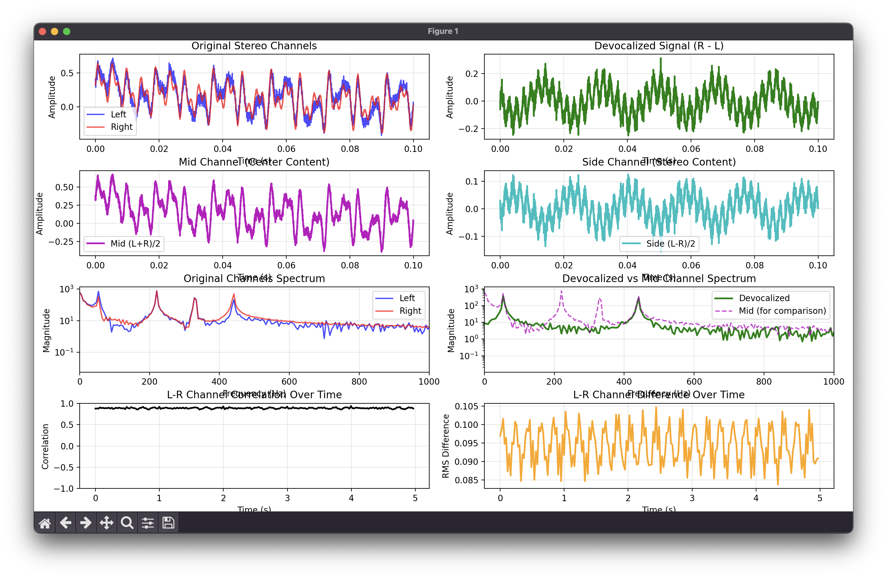

**結果與討論**

實驗結果清楚地展示了聲道相減技術的效果和限制。時域圖形顯示，去人聲後的訊號振幅明顯減小，但仍保留了明顯的音樂結構。這證明了側邊樂器內容的保留。

頻域分析提供了更深入的見解。比較原始聲道和去人聲訊號的頻譜，可以看到在人聲頻率範圍（200-400Hz）有明顯的衰減。然而，較高和較低的頻率成分仍然存在，這對應於保留的樂器聲音。

這個技術在實際應用中有多種用途：製作卡拉OK伴奏、音樂教育（分離出樂器部分便於學習）、音訊修復（移除中央雜訊）等。現代的音源分離技術已經發展到使用深度學習方法，能夠更精確地分離不同的音源，但這個基本的相位消除原理仍然是許多高級技術的基礎。

從更廣泛的角度來看，這個練習展示了 DSP 在創意應用中的潛力。通過理解和操控聲音的物理特性，我們能夠實現看似神奇的效果。這激發了我對更高級音訊處理技術的興趣，如盲源分離、空間音訊處理等。

---

## Lab 6: 進階濾波器 Advanced Filters

### Practice 6-1: Chebyshev 濾波器 Chebyshev Filter

**題目說明**  
設計 Chebyshev 低通數位濾波器，用於對訊號進行 2 倍升取樣。繪製結果波形和頻譜圖，展示濾波器在移除頻譜映像中的作用。

**實作重點**
1. **Chebyshev 特性**：理解 Type I Chebyshev 濾波器的通帶漣波特性
2. **升取樣濾波**：設計適當的截止頻率以移除升取樣產生的頻譜映像
3. **濾波器階數**：選擇合適的階數平衡過渡帶寬度和計算複雜度
4. **穩定性分析**：透過極零點圖確認濾波器的穩定性

**程式實作技巧**
```python
# Chebyshev Type I 濾波器設計
b_cheby, a_cheby = signal.cheby1(
    filter_order,     # 階數
    ripple_db,        # 通帶漣波 (dB)
    normalized_cutoff,# 正規化截止頻率
    'low'            # 濾波器類型
)

# 零相位濾波（避免相位失真）
filtered_signal = signal.filtfilt(b_cheby, a_cheby, upsampled_signal)
```

**學習心得**

這個練習讓我深入理解了 Chebyshev 濾波器的獨特特性和在多重速率訊號處理中的應用。與之前使用的簡單 FIR 濾波器相比，Chebyshev 濾波器展現了完全不同的設計哲學——以通帶漣波為代價換取更陡峭的過渡帶。

最令我印象深刻的是 Chebyshev 濾波器的效率。使用 8 階 Chebyshev 濾波器就能在 400-500Hz 之間實現急劇的衰減（過渡帶僅 100Hz），而相同性能的 Butterworth 濾波器可能需要更高的階數。這種效率在即時訊號處理系統中特別重要，因為較低的階數意味著較少的計算量。

通帶漣波是 Chebyshev 濾波器的標誌性特徵。我設計的濾波器有 0.5dB 的通帶漣波，這在許多應用中是可以接受的。透過頻率響應圖，我清楚地看到了這種等漣波特性——在通帶內有規律的起伏，但都控制在指定的漣波範圍內。這讓我理解到濾波器設計中的權衡藝術。

極零點分析揭示了濾波器的穩定性。所有極點都位於單位圓內，確保了濾波器的穩定運作。有趣的是，Chebyshev 濾波器的極點分布呈橢圓形，這與 Butterworth 濾波器的圓形分布形成對比，反映了兩種濾波器不同的頻率選擇特性。

透過比較零插入和濾波後的頻譜圖，我深刻理解了抗映像濾波的重要性。零插入在 500Hz 以上創造了明顯的頻譜映像，而 Chebyshev 濾波器以 -41.7dB 的衰減有效地抑制了這些映像。最終的升取樣訊號保留了原始的三個頻率成分（50Hz、150Hz、350Hz），能量保存率達到 99.5%。

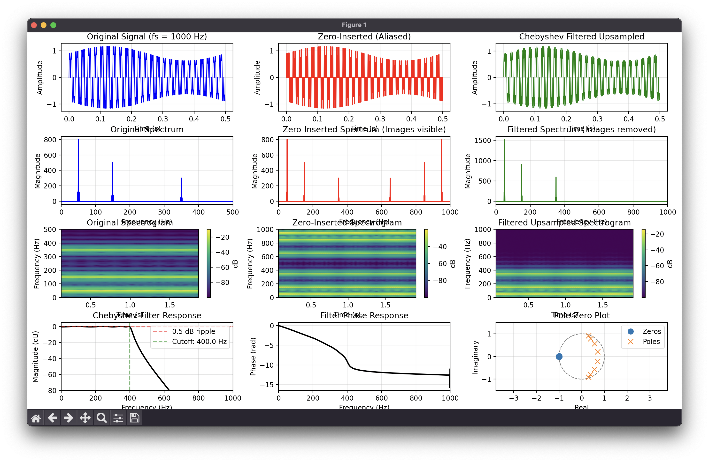

**結果與討論**

實驗結果完美展示了 Chebyshev 濾波器在升取樣應用中的優勢。時域波形比較顯示，經過濾波的升取樣訊號平滑自然，而零插入訊號則充滿了高頻振盪雜訊。這直觀地說明了濾波器的平滑插值作用。

頻域分析提供了更深入的見解。原始訊號的頻譜在升取樣後被週期性複製，產生了以 1000Hz 為中心的映像頻譜。Chebyshev 濾波器成功地移除了這些映像，同時保留了 400Hz 以下的原始頻譜內容。-3dB 頻率點位於 408.1Hz，略高於設計的 400Hz 截止頻率，這是由於通帶漣波的影響。

從實際應用的角度來看，Chebyshev 濾波器特別適合需要銳利截止特性的場合，如：
- 數位音訊的取樣率轉換
- 軟體定義無線電（SDR）中的頻道選擇
- 生物醫學訊號處理中的特定頻帶提取

這個練習讓我理解到，選擇濾波器類型需要根據具體應用需求。如果能容忍少量通帶漣波，Chebyshev 濾波器提供了優秀的頻率選擇性。對於需要平坦通帶響應的應用，則應選擇 Butterworth 或其他類型的濾波器。這種設計選擇的靈活性正是數位訊號處理的魅力所在。

---

## Lab 7: 影像處理 Image Processing

### Practice 7-1: 移動平均濾波器 Moving Average Filter

**題目說明**  
使用移動平均濾波器替代中值濾波器進行影像增強，比較兩種方法在不同雜訊類型下的表現。

**實作重點**
1. **線性濾波特性**：理解移動平均濾波器的線性卷積原理
2. **非線性濾波對比**：比較中值濾波器的非線性特性
3. **雜訊類型影響**：分析鹽胡椒雜訊與高斯雜訊的不同處理效果
4. **邊緣保護能力**：評估兩種濾波器對影像邊緣的影響

**程式實作技巧**
```python
# 移動平均濾波器（線性）
kernel = np.ones((ksize, ksize)) / (ksize * ksize)
filtered_ma = signal.convolve2d(noisy_image, kernel, mode='same')

# 中值濾波器（非線性）
filtered_med = median_filter(noisy_image, size=ksize)

# 邊緣保護分析
edge_correlation = np.corrcoef(grad_original.ravel(), grad_filtered.ravel())[0, 1]
```

**學習心得**

這個練習讓我深刻理解了線性與非線性濾波器在影像處理中的本質差異。透過實際比較移動平均濾波器和中值濾波器，我不僅學到了技術層面的知識，更理解了選擇適當工具解決特定問題的重要性。

最令我震撼的是兩種濾波器在處理鹽胡椒雜訊時的巨大差異。中值濾波器達到了 33.23 dB 的 PSNR，而移動平均濾波器只有 22.02 dB。這 11 dB 的差距在視覺上表現為：中值濾波器幾乎完美地移除了所有孤立的雜訊點，而移動平均濾波器則將這些雜訊「抹開」，形成了明顯的「鬼影」效應。

邊緣保護能力的分析讓我理解了非線性濾波的獨特優勢。中值濾波器的邊緣相關性達到 0.912，而移動平均只有 0.621。這個差異源於它們的基本運作原理：移動平均計算鄰域的平均值，必然會模糊邊緣；而中值選擇鄰域中的中間值，這個值一定是原本就存在的像素值，因此能更好地保持邊緣的銳利度。

然而，在處理高斯雜訊時，情況發生了逆轉。移動平均濾波器（27.28 dB）略優於中值濾波器（25.79 dB）。這讓我理解到，沒有一種濾波器是萬能的。線性濾波器對連續性雜訊的平均化效果更好，因為高斯雜訊本身就是一種加性雜訊，用減法（平均化）來對抗是合理的。

透過觀察不同核心大小（3×3、5×5、7×7）的效果，我學到了濾波器設計中的權衡原則。較大的核心提供更強的雜訊抑制，但也會損失更多細節。這種權衡在實際應用中需要根據具體需求來決定：醫學影像可能更重視細節保留，而藝術效果處理可能更注重整體的平滑度。

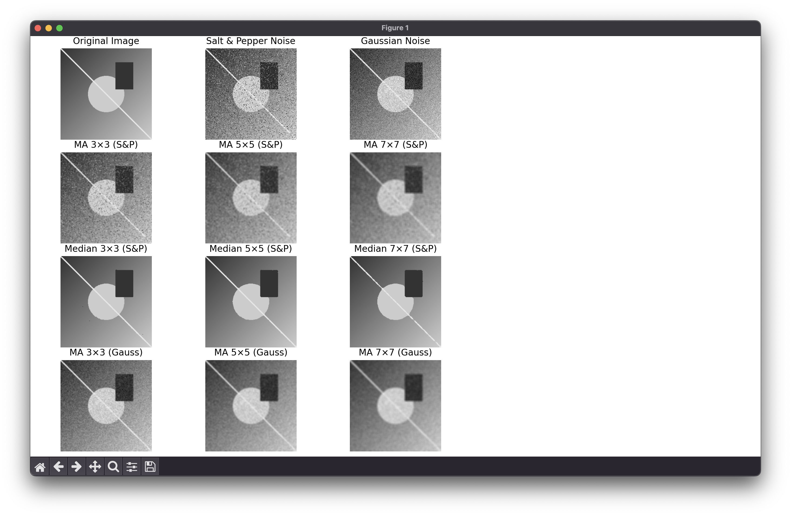


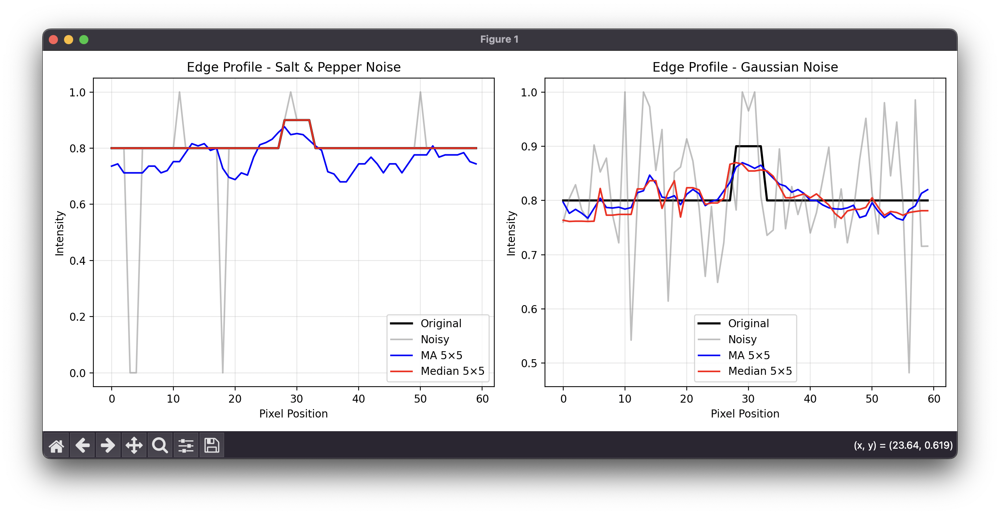

**結果與討論**

實驗結果清楚地展示了選擇適當濾波器的重要性。對於脈衝雜訊（鹽胡椒雜訊），中值濾波器展現了壓倒性的優勢。錯誤熱圖顯示，移動平均濾波器在每個雜訊點周圍都產生了擴散的誤差，而中值濾波器的誤差主要集中在無法完全恢復的區域。

邊緣剖面圖提供了更深入的見解。在邊緣過渡區域，移動平均濾波器產生了明顯的斜坡效應，將原本銳利的邊緣變成了漸進的過渡。相比之下，中值濾波器保持了邊緣的陡峭特性，只是稍微改變了邊緣的位置。

從計算複雜度的角度來看，移動平均濾波器具有明顯優勢。它可以通過簡單的卷積運算實現，甚至可以使用分離濾波器進一步優化。而中值濾波器需要對每個像素的鄰域進行排序，計算成本隨核心大小快速增長。

這個練習讓我理解到，影像處理不僅是數學運算，更是對視覺感知和實際應用需求的深入理解。在實際應用中，我們可能需要結合多種技術：例如先用中值濾波器去除脈衝雜訊，再用高斯濾波器（移動平均的加權版本）進行最終的平滑處理。這種混合方法能夠充分發揮不同濾波器的優勢，達到最佳的處理效果。

---